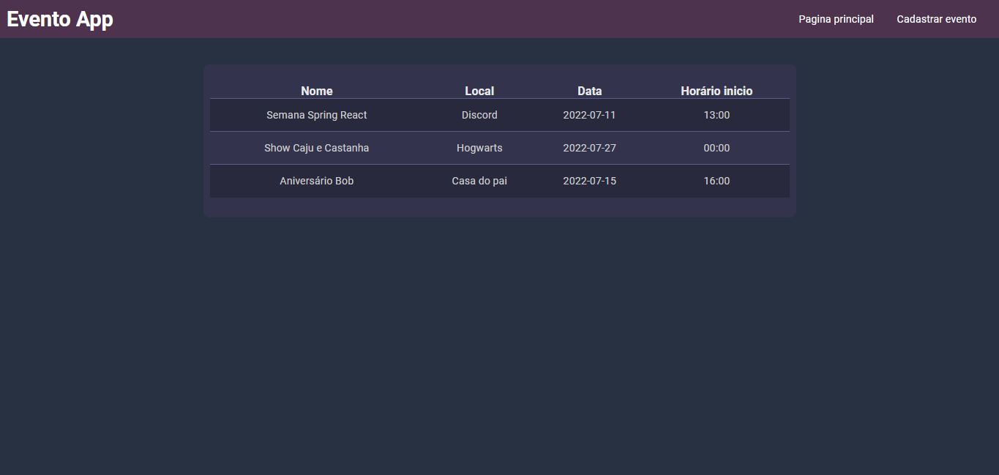

# Eventos app

Eventos App é uma aplicação web desenvolvida para organizar os seus eventos, sendo possível criar, visualizar, atualizar e deletar eventos.

## Ferramentas e bibliotecas utilizadas

* [Visual Studio Code](https://code.visualstudio.com/)

* [Maven](https://maven.apache.org/)
 
* [Thymeleaf](https://www.thymeleaf.org/)
 
* [Spring](https://spring.io/)

* [Lombok](https://projectlombok.org/)

## Licença
* [MIT](https://choosealicense.com/licenses/mit/)